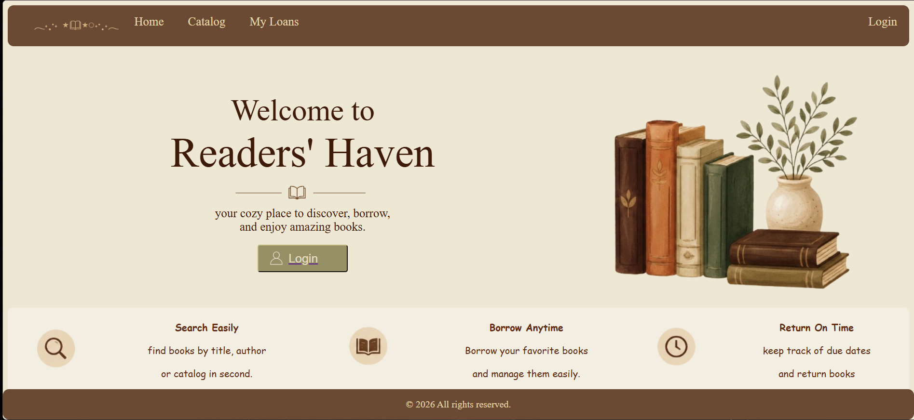
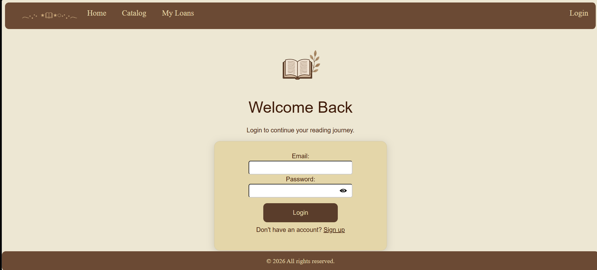
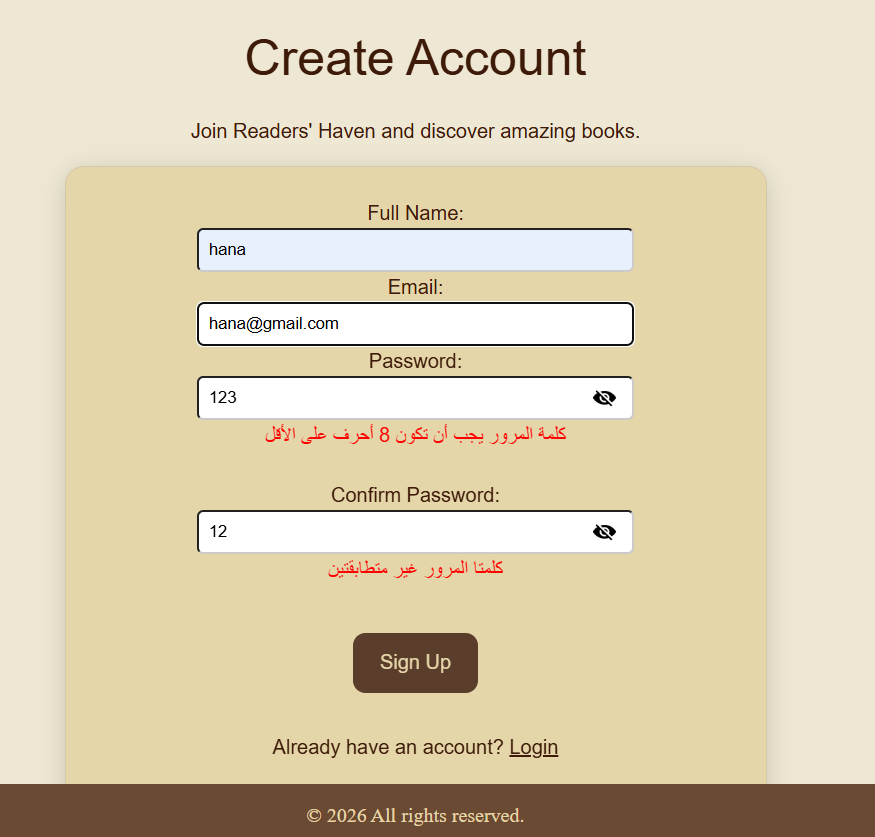
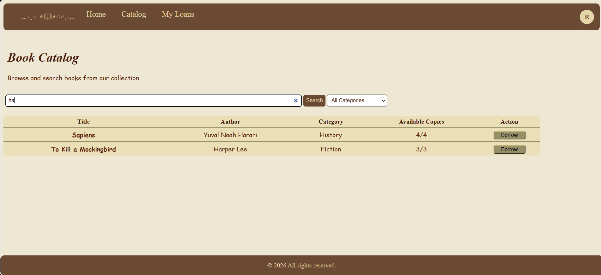
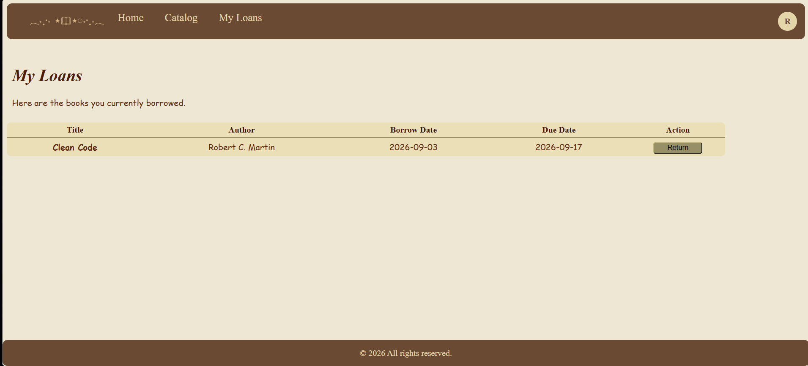
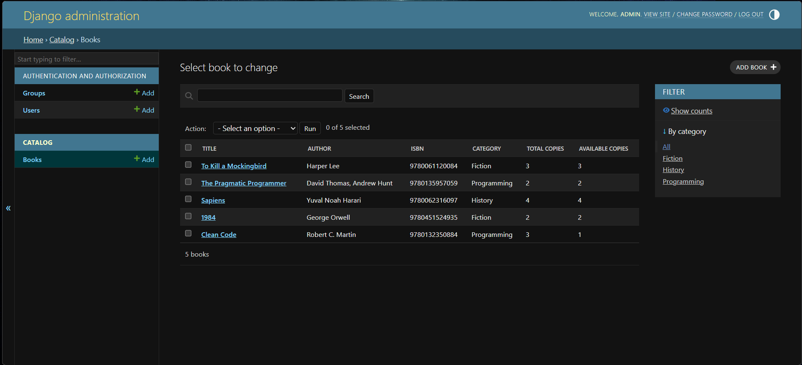
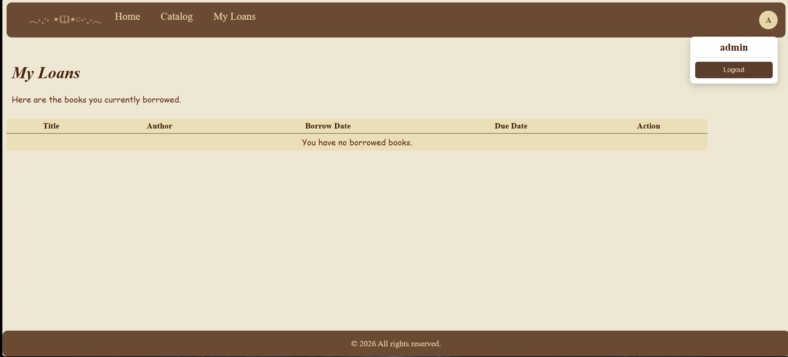
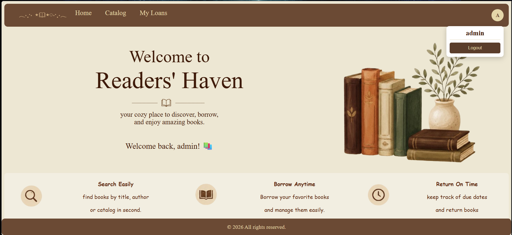

# Readers' Haven — Library Management System

A full-stack web application for managing a library's book catalog, member accounts, and borrowing/return workflow. Built with Django, HTML5, CSS3, and vanilla JavaScript as a one-week academic team sprint.



---

## Table of Contents

- [Overview](#overview)
- [Features](#features)
- [Tech Stack](#tech-stack)
- [Project Structure](#project-structure)
- [Getting Started](#getting-started)
  - [Prerequisites](#prerequisites)
  - [Installation](#installation)
  - [Running the Project](#running-the-project)
- [Demo Accounts](#demo-accounts)
- [Screenshots](#screenshots)
- [Security Measures](#security-measures)
- [Known Limitations](#known-limitations)
- [Team & Contributions](#team--contributions)
- [Development Approach](#development-approach)

---

## Overview

Readers' Haven is a Django-based library management system that allows registered members to browse a book catalog, borrow and return books, and track their active loans — while giving librarians full catalog and loan visibility through Django's built-in admin site. The project was scoped and delivered by a six-person student team over a seven-day sprint, following a formal Software Requirements Specification (SRS).

## Features

- **Member authentication** — secure signup, login, and logout, with email-based accounts and hashed passwords.
- **Book catalog** — browse all books, with live client-side search and category filtering.
- **Borrowing & returning** — atomic, race-condition-safe borrow/return flow with real-time available-copy tracking.
- **My Loans dashboard** — members see their currently borrowed books, due dates, and overdue status.
- **Librarian tools** — full catalog and loan management via Django Admin, with no custom admin UI required.
- **Responsive feedback** — clear success/error messaging for every user action (login, signup, borrow, return).
- **Profile menu** — authenticated users get a personalized navbar icon and dropdown with logout.

## Tech Stack

| Layer | Technology |
|---|---|
| Backend | Django (Python) |
| Database | SQLite |
| Frontend | HTML5, CSS3, vanilla JavaScript |
| Auth | Django's built-in authentication system |
| Admin | Django Admin |

## Project Structure

```
library-management-system/
├── accounts/           # Signup, login, logout (auth logic)
├── catalog/             # Book model, catalog browsing, search
├── loans/                # Borrow/return business logic
├── config/               # Project settings and root URL configuration
├── templates/           # HTML templates (Django Template Language)
│   └── loans/
├── static/
│   ├── css/
│   ├── js/
│   └── images/
├── manage.py
└── requirements.txt
```

## Getting Started

### Prerequisites

- Python 3.10+ installed and added to PATH
- pip
- Git

### Installation

1. **Clone the repository**
   ```bash
   git clone https://github.com/0xN3Z/library-management-system.git
   cd library-management-system
   ```

2. **Create and activate a virtual environment**
   ```bash
   python -m venv venv
   ```
   Windows:
   ```bash
   venv\Scripts\activate
   ```
   macOS/Linux:
   ```bash
   source venv/bin/activate
   ```

3. **Install dependencies**
   ```bash
   pip install -r requirements.txt
   ```

4. **Apply database migrations**
   ```bash
   python manage.py migrate
   ```

5. **Seed sample book data**
   ```bash
   python manage.py seed_books
   ```

6. **Create an admin account**
   ```bash
   python manage.py createsuperuser
   ```

### Running the Project

```bash
python manage.py runserver
```

Then open **http://127.0.0.1:8000/** in your browser.


**Home**


**Login**


**Signup**


**Catalog**


**My Loans**


**Admin — Books**


**Admin — Loans**


**Profile Menu**


## Security Measures

The following security practices were applied throughout the project:

- **Password hashing** — all passwords are hashed via Django's built-in `create_user()`, never stored in plain text.
- **Password strength validation** — enforced via Django's `validate_password()` (minimum length, similarity checks, common-password rejection).
- **CSRF protection** — every form (`login`, `signup`, `logout`) includes ``.
- **Logout via POST only** — prevents CSRF-via-GET attacks that could log a user out via a crafted link or image tag.
- **Access control** — catalog and loan pages are protected with `@login_required`; unauthenticated users are redirected to login.
- **Prevented user enumeration** — signup and login error messages are worded to avoid confirming whether a given email is registered.
- **SQL injection protection** — all database access goes through Django's ORM (no raw SQL), which parameterizes queries by default.
- **XSS protection** — Django's template engine auto-escapes all variable output; no `|safe` filters are used on user-supplied data.
- **Race-condition-safe transactions** — borrow/return operations use `transaction.atomic()` with `select_for_update()` to prevent two concurrent requests from both borrowing the last available copy.
- **Additional hardening** — `SESSION_COOKIE_HTTPONLY`, `CSRF_COOKIE_HTTPONLY`, `X_FRAME_OPTIONS: DENY`, and session expiry are configured in `settings.py`.

### Known Limitations

These are acknowledged gaps, intentionally out of scope for a one-week academic sprint, and recommended before any production deployment:

- **No login rate-limiting / brute-force protection** — would require a package such as `django-axes`.
- **No HTTPS enforcement** — not applicable to local development; required for production.
- **`DEBUG = True`** — intentional for development; must be set to `False` with a proper `ALLOWED_HOSTS` list before deployment.
- **No automated test suite** — testing was performed manually against the full user flow (see Team & Contributions).

## Team & Contributions

| Member | Role | Contribution |
|---|---|---|
| Sara_Saif | Backend — Auth | Signup/login/logout views, forms, and password security |
| Mennat-Allah_Alaa | Backend — Models & Admin | Book model, Django Admin registration, sample data seeding |
| Ahmed | Backend — Borrow/Return | Loan model, borrow/return logic, availability checks, race-condition handling |
| Ranwa_Wael | Front-End — Templates & CSS | Page layouts, navigation, catalog/my-loans/auth page design |
| Alaa-Allah_Mustafa | Front-End — JavaScript | Signup validation, live catalog search/filter |
| Reem_Ahmed | Integration & QA Lead | Repository setup, cross-branch integration, security hardening, bug fixing, testing, documentation |

## Development Approach

Given the one-week timeline, integration was performed progressively and reviewed at each step rather than through a strict branch-per-task workflow throughout. Individual contributions — most notably the borrowing/return logic — were isolated in dedicated feature branches (e.g. `feature/loans-ahmed`) before being reviewed and merged into `main`, ensuring no work was lost even when conflicts arose from parallel development.

---

<p align="center">Built with 📖 by <strong>Ctrl Alt win</strong> — 2026</p>

