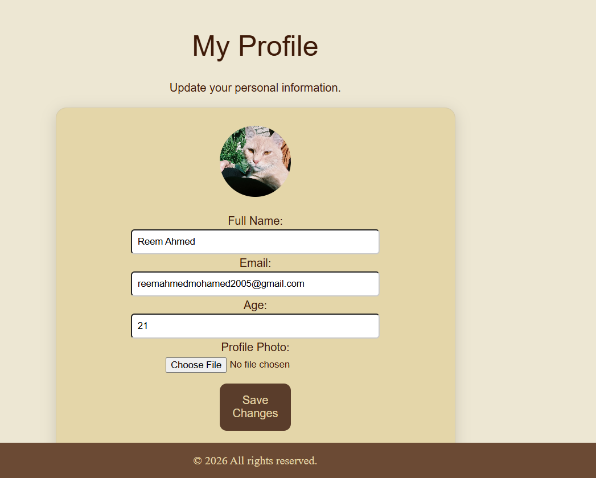

# 📚 Readers' Haven — Library Management System

A full-stack web application for managing a library's book catalog, member accounts, and borrowing/return workflow. Built with Django, HTML5, CSS3, and vanilla JavaScript as a one-week academic team sprint.


---

## Table of Contents

- [Overview](#overview)
- [Features](#features)
- [Tech Stack](#tech-stack)
- [Project Structure](#project-structure)
- [Getting Started](#getting-started)
  - [Prerequisites](#prerequisites)
  - [Installation](#installation)
  - [Running the Project](#running-the-project)
- [Demo Accounts](#demo-accounts)
- [Screenshots](#screenshots)
- [Security Measures](#security-measures)
- [Known Limitations](#known-limitations)
- [Testing](#testing)
- [Team & Contributions](#team--contributions)
- [Development Approach](#development-approach)

---

## Overview

Readers' Haven is a Django-based library management system that allows registered members to browse a book catalog, borrow and return books, and track their active loans — while giving librarians full catalog and loan visibility through Django's built-in admin site. The project was scoped and delivered by a six-person student team over a seven-day sprint, following a formal Software Requirements Specification (SRS).

## Features

- **Member authentication** — secure signup, login, and logout, with email-based accounts and hashed passwords.
- **Editable member profile** — members can update their name, age, email, and upload a profile photo, which replaces the default initial-letter icon in the navbar.
- **Book catalog** — browse all books, with live client-side search and category filtering.
- **Author-based suggestions** — searching for a book with zero available copies surfaces other available titles by the same author, so members always leave with an alternative.
- **Borrowing & returning** — atomic, race-condition-safe borrow/return flow with real-time available-copy tracking.
- **My Loans dashboard** — members see their currently borrowed books, due dates, and overdue status.
- **Due-date reminders** — an in-app banner appears on the My Loans page when a book is due within 3 days, and a separate overdue banner appears once the due date has passed.
- **Librarian tools** — full catalog and loan management via Django Admin, with no custom admin UI required.
- **Responsive feedback** — clear success/error messaging for every user action (login, signup, borrow, return, profile update).
- **Profile menu** — authenticated users get a personalized navbar icon (their photo, or their initial if none is set) and a dropdown with Edit Profile and Logout.

## Tech Stack

| Layer | Technology |
|---|---|
| Backend | Django (Python) |
| Database | SQLite |
| Frontend | HTML5, CSS3, vanilla JavaScript |
| Auth | Django's built-in authentication system |
| Image handling | Pillow (profile photo uploads) |
| Admin | Django Admin |

## Project Structure

```
library-management-system/
├── accounts/           # Signup, login, logout, and profile editing
├── catalog/             # Book model, catalog browsing, search, suggestions
├── loans/                # Borrow/return business logic, due-date tracking
├── config/               # Project settings and root URL configuration
├── templates/           # HTML templates (Django Template Language)
│   └── loans/
├── static/
│   ├── css/
│   ├── js/
│   └── images/
├── media/                # User-uploaded profile photos (not committed to Git)
├── manage.py
└── requirements.txt
```

## Getting Started

### Prerequisites

- Python 3.10+ installed and added to PATH
- pip
- Git

### Installation

1. **Clone the repository**
   ```bash
   git clone https://github.com/0xN3Z/library-management-system.git
   cd library-management-system
   ```

2. **Create and activate a virtual environment**
   ```bash
   python -m venv venv
   ```
   Windows:
   ```bash
   venv\Scripts\activate
   ```
   macOS/Linux:
   ```bash
   source venv/bin/activate
   ```

3. **Install dependencies**
   ```bash
   pip install -r requirements.txt
   ```

4. **Apply database migrations**
   ```bash
   python manage.py migrate
   ```

5. **Seed sample book data**
   ```bash
   python manage.py seed_books
   ```

6. **Create an admin account**
   ```bash
   python manage.py createsuperuser
   ```

### Running the Project

```bash
python manage.py runserver
```

Then open **http://127.0.0.1:8000/** in your browser.

## Demo Accounts

| Role | Email | Password | Access |
|---|---|---|---|
| Member | reemahmmedmohamed2005@gmail.com | (insert password used at signup) | Catalog, borrow/return, my loans, profile editing |
| Admin | (created via `createsuperuser`) | (set during setup) | `/admin/` — full catalog & loan management |

> Fill in the actual demo password(s) above before submission.

## Screenshots

> Save each image below at the path shown, then it will render automatically in this README.

| Screenshot | Save as |
|---|---|
| Home page (logged out) | `docs/screenshots/home.png` |
| Home page (logged in, showing "Welcome back") | `docs/screenshots/home-logged-in.png` |
| Login page | `docs/screenshots/login.png` |
| Signup page (with validation error showing) | `docs/screenshots/signup.png` |
| Book catalog with search/filter | `docs/screenshots/catalog.png` |
| Catalog showing the author-based suggestions box | `docs/screenshots/catalog-suggestions.png` |
| My Loans page with an active loan | `docs/screenshots/my-loans.png` |
| My Loans page showing the due-soon or overdue banner | `docs/screenshots/my-loans-reminder.png` |
| Edit Profile page (with photo uploaded) | `docs/screenshots/profile-edit.png` |
| Navbar showing the uploaded profile photo | `docs/screenshots/profile-navbar.png` |
| Django Admin — Book list | `docs/screenshots/admin-books.png` |
| Django Admin — Loan list | `docs/screenshots/admin-loans.png` |

Once saved, each will appear here:

**Home**


**Login**


**Signup**


**Catalog**


**Catalog — Author Suggestions**


**My Loans**


**Edit Profile**


**Admin — Books**


**Admin — Loans**


## Security Measures

The following security practices were applied throughout the project:

- **Password hashing** — all passwords are hashed via Django's built-in `create_user()`, never stored in plain text.
- **Password strength validation** — enforced via Django's `validate_password()` (minimum length, similarity checks, common-password rejection).
- **CSRF protection** — every form (`login`, `signup`, `logout`, `profile`) includes ``.
- **Logout via POST only** — prevents CSRF-via-GET attacks that could log a user out via a crafted link or image tag.
- **Access control** — catalog, loan, and profile pages are protected with `@login_required`; unauthenticated users are redirected to login.
- **Prevented user enumeration** — signup and login error messages are worded to avoid confirming whether a given email is registered.
- **Email-change validation** — when a member updates their email in their profile, the system checks it doesn't collide with another existing account before saving.
- **SQL injection protection** — all database access goes through Django's ORM (no raw SQL), which parameterizes queries by default.
- **XSS protection** — Django's template engine auto-escapes all variable output; no `|safe` filters are used on user-supplied data.
- **Race-condition-safe transactions** — borrow/return operations use `transaction.atomic()` with `select_for_update()` to prevent two concurrent requests from both borrowing the last available copy.
- **Additional hardening** — `SESSION_COOKIE_HTTPONLY`, `CSRF_COOKIE_HTTPONLY`, `X_FRAME_OPTIONS: DENY`, and session expiry are configured in `settings.py`.
- **Secure profile photo uploads** — uploaded files are defended in multiple layers rather than trusted at face value:
  - File size is capped (3MB) before any further processing.
  - Declared MIME type and file extension are both checked against an allow-list, blocking simple disguises like a script renamed to `.jpg`.
  - The file is actually opened and decoded with Pillow (`Image.verify()`), which rejects anything that isn't a genuine, complete image even if it passed the checks above.
  - Image resolution is capped to guard against decompression-bomb style files.
  - The accepted image is **re-encoded from scratch** into a normalized JPEG before being saved, stripping any embedded metadata or hidden payload from the original upload rather than storing the user's raw file.

### Known Limitations

These are acknowledged gaps, intentionally out of scope for a one-week academic sprint, and recommended before any production deployment:

- **No login rate-limiting / brute-force protection** — would require a package such as `django-axes`.
- **No HTTPS enforcement** — not applicable to local development; required for production.
- **`DEBUG = True`** — intentional for development; must be set to `False` with a proper `ALLOWED_HOSTS` list before deployment.
- **No automated test suite** — testing was performed manually against the full user flow.
- **Due-date reminders are in-app only** — shown as a banner on the My Loans page rather than sent via email or push notification, to avoid the added complexity of configuring a real mail server for a one-week sprint.
- **No malware/virus scanning on uploads** — file-type, size, and structural validation are enforced (see Security Measures above), but a production deployment handling sensitive data would add antivirus scanning as an additional layer.
- **Development server only** — `media/` files are served directly by Django's development server (`runserver`), which is explicitly not intended for production use. In a production deployment, uploaded files should be served as static assets by the web server (e.g. Nginx) rather than through a Python process, ensuring they can never be executed even in an unexpected misconfiguration.

## Testing

The system was manually tested end-to-end against the full acceptance criteria, including:

- Sign up, log in, browse/search the catalog, and borrow a book with available copies.
- Attempting to borrow a book with zero available copies is correctly blocked with a clear error message, and alternative titles by the same author are suggested when applicable.
- Returning a borrowed book updates the available-copy count immediately.
- The My Loans page correctly displays a "due soon" reminder within 3 days of the due date, and an "overdue" alert once it has passed.
- Editing a profile (name, age, email, photo) saves correctly and reflects immediately across the site, including the navbar icon.
- Attempting to change an email to one already in use by another account is rejected with a clear message.
- Unauthenticated users attempting to access protected pages are redirected to the login page.

## Team & Contributions

| Member | Role | Contribution |
|---|---|---|
| Sara Saif | Backend — Auth | Signup/login/logout views, forms, and password security |
| Mennat-Allah Alaa | Backend — Models & Admin | Book model, Django Admin registration, sample data seeding |
| Ahmed | Backend — Borrow/Return | Loan model, borrow/return logic, availability checks, race-condition handling |
| Ranwa Wael | Front-End — Templates & CSS | Page layouts, navigation, catalog/my-loans/auth page design |
| Alaa | Front-End — JavaScript | Signup validation, live catalog search/filter |
| Reem Ahmed | Integration & QA Lead | Repository setup, cross-branch integration, security hardening, profile editing, due-date reminders, author-based suggestions, bug fixing, testing, documentation |

## Development Approach

Given the one-week timeline, integration was performed progressively and reviewed at each step rather than through a strict branch-per-task workflow throughout. Individual contributions — most notably the borrowing/return logic — were isolated in dedicated feature branches (e.g. `feature/loans-ahmed`) before being reviewed and merged into `main`, ensuring no work was lost even when conflicts arose from parallel development. Later-stage enhancements (profile editing, due-date reminders, and author-based suggestions) were added directly on `main` after the core feature set was stable and fully tested.

---

<p align="center">Built with 📖 by <strong>Ctrl Alt Win</strong> — 2026</p>